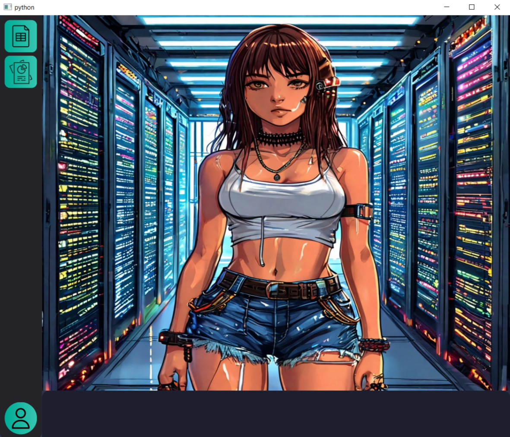
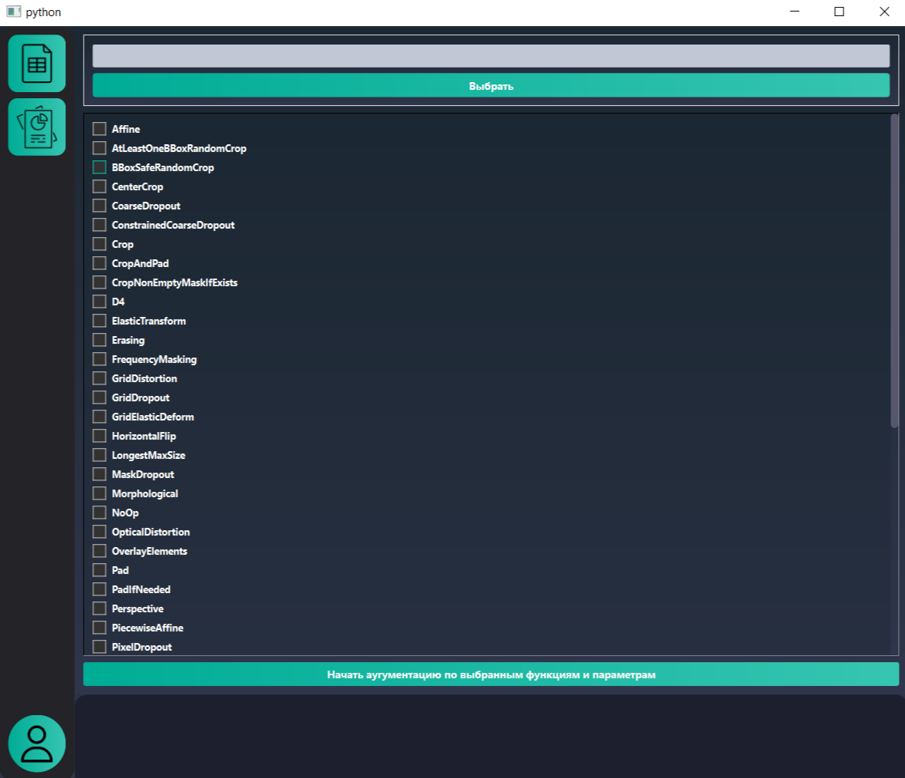
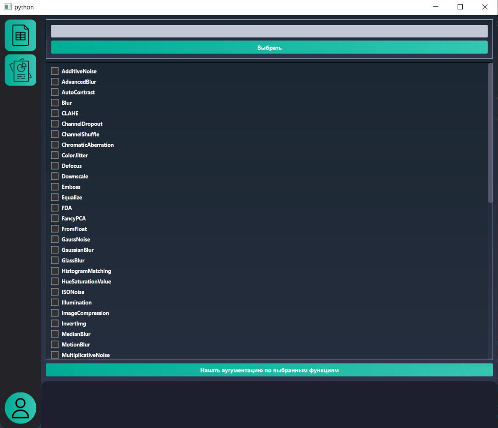
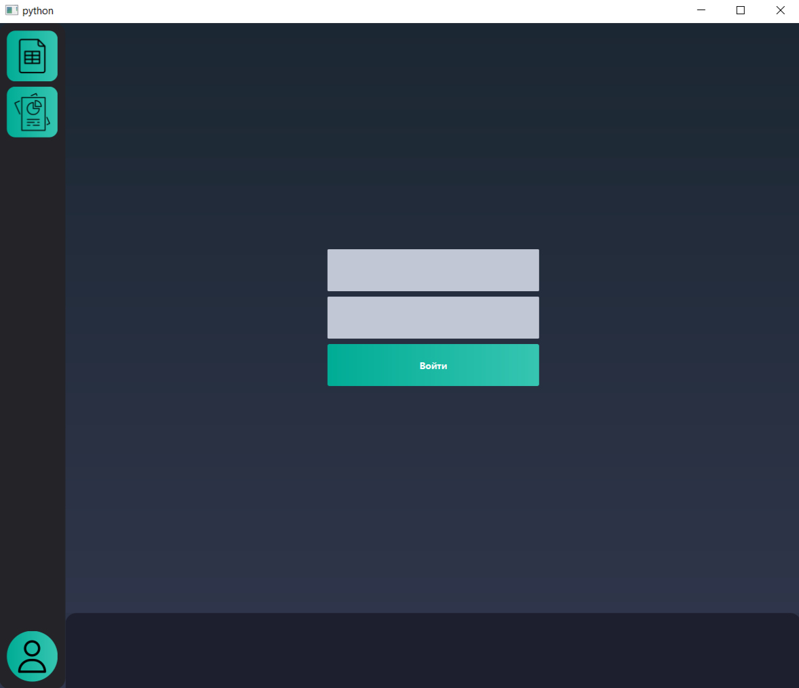

<br />
<div align="center">
    <h3 align="center">Исследуй возможности аугументации! Найди лучшее для себя</h3>

  <p align="center">
    <a href="https://t.me/KedrOboroni">Сообщи об ошибке!</a>
  </p>
</div>


# README

## Описание проекта

Данный проект разработан с использованием библиотеки PySide6 для создания графического пользовательского интерфейса (GUI) и включает в себя различные компоненты для работы с данными и их визуализации. Основная цель проекта - предоставить удобный интерфейс для работы с изображениями и их аугментацией, что позволяет улучшить качество обучения моделей YOLO (You Only Look Once).

## Структура проекта

### 1. ui

Содержит компоненты интерфейса, включая виджеты, кнопки и метки.

- **buttons/**: Содержит классы кнопок, используемых в интерфейсе.
  - **sidebarButtons/**: Кнопки на боковой панели.
    - **analysButton/**: Кнопка для анализа данных.
      - `analys.svg`: Иконка для кнопки анализа.
      - `__init__.py`: Инициализация класса `analysButton`, который наследует от `sidebarButton`. Кнопка устанавливает иконку и размер.
    - **dbButton/**: Кнопка для работы с базой данных.
      - `db.svg`: Иконка для кнопки работы с базой данных.
      - `__init__.py`: Инициализация класса `dbButton`, который наследует от `sidebarButton`. Кнопка устанавливает иконку и размер.
    - **reportButton/**: Кнопка для генерации отчетов.
      - `report.svg`: Иконка для кнопки генерации отчетов.
      - `__init__.py`: Инициализация класса `reportButton`, который наследует от `sidebarButton`. Кнопка устанавливает иконку и размер.
    - **tabelButton/**: Кнопка для отображения таблиц.
      - `tabel.svg`: Иконка для кнопки отображения таблиц.
      - `__init__.py`: Инициализация класса `tabelButton`, который наследует от `sidebarButton`. Кнопка устанавливает иконку и размер.
    - **userButton/**: Кнопка для управления пользователями.
      - `user.svg`: Иконка для кнопки управления пользователями.
      - `__init__.py`: Инициализация класса `userButton`, который наследует от `sidebarButton`. Кнопка устанавливает иконку, размер и стиль.

- **labels/**: Содержит классы меток для отображения информации.
  - **errorLabel/**: Метка для отображения ошибок.
    - `__init__.py`: Инициализация класса `errorLabel`, который наследует от `QLabel`. Метка содержит поле для ввода информации об ошибках и статус-бар для отображения прогресса.
  - **sidebarLabel/**: Метка для боковой панели.
    - `__init__.py`: Инициализация класса `sidebarLabel`, который наследует от `QLabel`. Содержит кнопки для навигации между различными функциями приложения.

- **stackedWidget/**: Содержит класс для управления вкладками в интерфейсе.
  - `__init__.py`: Инициализация класса `QStackedWidget`, который позволяет переключаться между различными виджетами в приложении.

### 2. processes

Содержит классы и функции для обработки данных и выполнения фоновых задач.

- **process_aug.py**: Содержит класс `ProcessThread`, который управляет многопоточными задачами для аугментации изображений. Использует библиотеку `multiprocessing` для выполнения аугментации в отдельном процессе, что позволяет избежать блокировки интерфейса.

### 3. events

Содержит обработчики событий, которые реагируют на действия пользователя в интерфейсе.

- **internal/**: Внутренние обработчики событий.
  - **on_btnChange.py**: Обработчик для кнопки, которая открывает диалог выбора папки для загрузки изображений.

### 4. dictsParams

Содержит словари с параметрами аугментации и другими настройками.

- **__init__.py**: Содержит словари `dictInternalAug_brightness_and_transform_settings`, которые хранят функции аугментации и их параметры. Эти словари используются для динамического выбора аугментаций в зависимости от пользовательского ввода.

### 5. actions_augumentation

Содержит функции для аугментации изображений и работы с классами.

- **aug/**: Содержит классы и функции для аугментации.
  - **core_aug.py**: Функции для работы с аннотациями аугментации (файлы разметки).
  - **entites_aug.py**: Функции для применения аугментаций к изображениям и получения новых координат объектов.
  - **engine.py**: Содержит функции для рисования ограничивающих рамок на изображениях.

## Для запуска приложения

1. Убедитесь, что у вас установлен Python и библиотека PySide6.
2. Клонируйте репозиторий на свой компьютер:

   ```bash
   git clone https://github.com/Kedroboroni/aug_yolo_research
   ```

3. Установите необходимые зависимости, если они указаны в `requirements.txt`:

   ```bash
   pip install -r requirements.txt
   ```

4. Запустите файл `mainUI.py` для запуска приложения:

   ```bash
   python ui/mainUI.py
   ```

Теперь вы можете использовать приложение для работы с изображениями и их аугментацией, что позволит улучшить качество обучения моделей YOLO.


## При работе в приложении

<div style="text-align: center;">
    
    <p style="text-align: left;">- Приветственный экран</p>
</div>


<div style="display: flex; align-items: center; justify-content: center;">
    
    <p style="margin-left: 10px; text-align: left;">- Кнопка для перехода к списку с яркостными характеристиками, представленными в albumentations</p>
</div>

<div style="display: flex; align-items: center; justify-content: center;">
    
</div>


<div style="display: flex; align-items: center; justify-content: center;">
    
    <p style="margin-left: 10px; text-align: left;">- - Кнопка для перехода к списку транспортировочных характеристик, представленным в albumentations ###(ПОКА В ТЕСТЕ)</p>
</div>

<div style="display: flex; align-items: center; justify-content: center;">
    
</div>


<div style="display: flex; align-items: center; justify-content: center;">
    
    <p style="margin-left: 10px; text-align: left;">- Кнопка для авторизации пользователя ###(ПОКА В ТЕСТЕ)</p>
</div>

<div style="display: flex; align-items: center; justify-content: center;">
    
</div>


