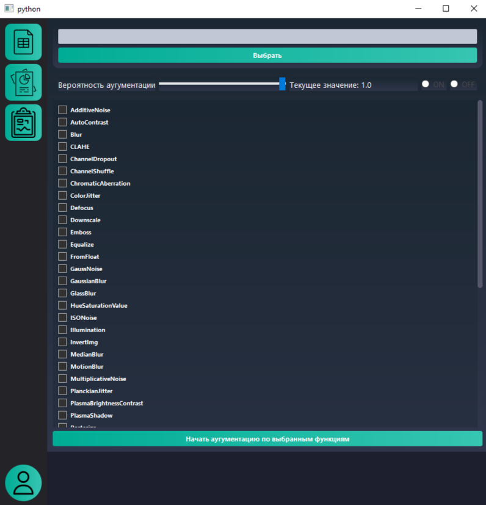
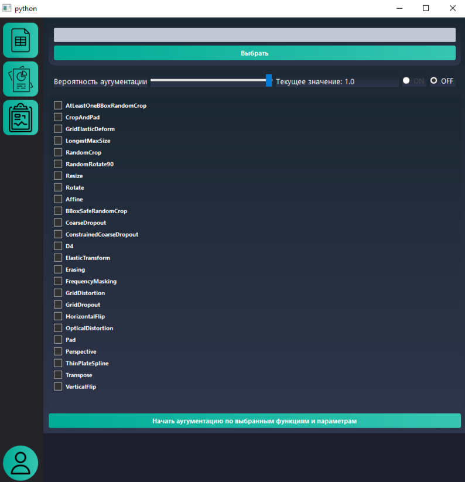
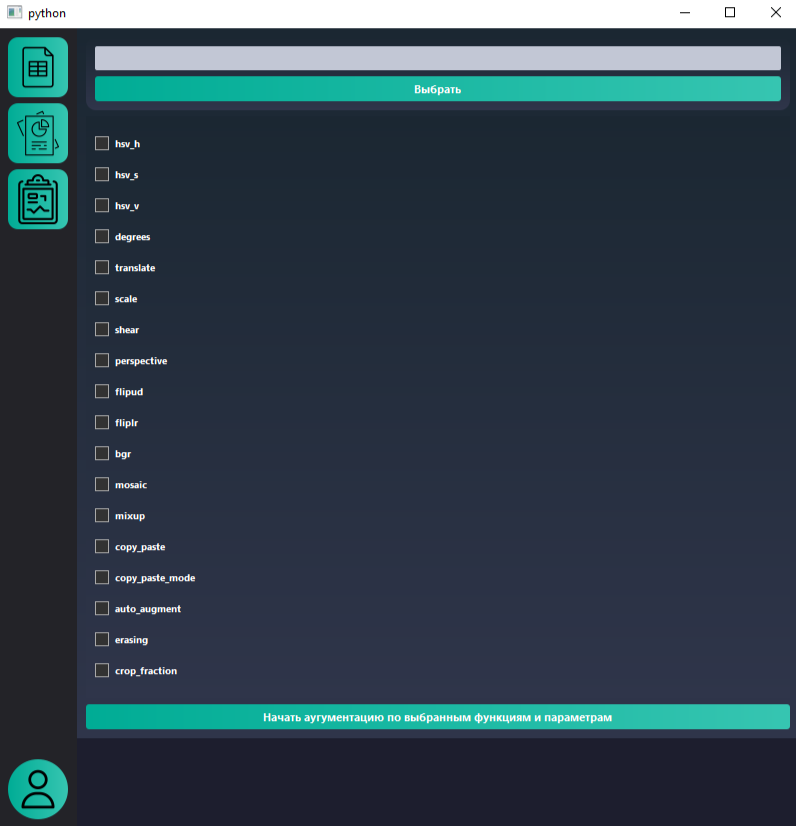
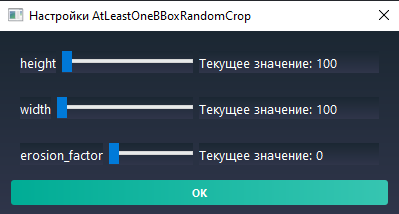

<br />
<div align="center">
    <h3 align="center">Исследуй возможности аугументации! Найди лучшее для себя</h3>

  <p align="center">
    <a href="https://t.me/KedrOboroni">Сообщи об ошибке!</a>
  </p>
</div>


# Документация по проекту

## 📌 Общее описание
Проект представляет собой десктопное приложение, разработанное для исследования различных методов аугментации на качество обучения моделей YOLO. Приложение предоставляет удобный графический интерфейс для работы с изображениями и их аугментацией.
Так же может использоваться для аугументации вашего dataset's

## 🛠 Технический стек
- **Основной язык**: Python
- **GUI Framework**: PySide6
- **ML/CV библиотеки**: YOLO, albumentations
- **Обработка изображений**: OpenCV
- **Многопроцессорность**: multiprocessing, QThread

## 📁 Структура проекта

### 1. UI Компоненты (`ui/`)
```
ui/
├── buttons/
│ ├── sidebarButtons/
│ │ ├── analysButton/ # Анализ данных
│ │ ├── dbButton/ # Работа с БД
│ │ ├── reportButton/ # Генерация отчётов
│ │ ├── tabelButton/ # Таблицы
│ │ └── userButton/ # Управление пользователями
├── labels/
│ ├── errorLabel/ # Отображение ошибок
│ └── sidebarLabel/ # Боковая панель
└── stackedWidget/ # Управление вкладками
```

### 2. Процессы (`processes/`)
```
processes/
├── process_aug.py # Многопоточная аугментация
└── process_yolo_run.py # Управление YOLO
```

### 3. События (`events/`)
```
events/
├── internal/ # Внутренние обработчики
│ └── on_btnChange.py # Обработка UI событий
└── external/ # Внешние обработчики
```

### 4. Параметры (`dictsParams/`)
```dictsParams/
├── manageParams.py # Управление параметрами
└── init.py # Инициализация параметров
```

### 5. Аугментация (`actions_augumentation/`)
```
actions_augumentation/
├── yolo_train/ # Обучение YOLO
├── aug/ # Методы аугментации
└── convert_utils/ # Конвертация форматов   
```


## 🔄 Процесс работы приложения

### Этап 1: Инициализация
- Запуск главного окна
- Загрузка конфигурации
- Инициализация компонентов UI

### Этап 2: Работа с данными
- Загрузка изображений (поддерживается формат JPG)
- Валидация входных данных
- Предварительная обработка

### Этап 3: Аугментация
- Выбор методов аугментации:
  - Яркостные преобразования
  - Геометрические преобразования
  - Комбинированные методы
- Настройка параметров
- Применение аугментации

### Этап 4: Обучение YOLO
- Подготовка данных
- Настройка параметров обучения
- Запуск процесса обучения
- Мониторинг прогресса

### Этап 5: Анализ результатов
- Сбор метрик
- Визуализация результатов
- Формирование отчётов

## 📊 Интерфейс приложения
Основные разделы:
- Приветственный экран
- Начальная настройка
- Выбор режима работы
- Таблица яркостных характеристик
- Список доступных преобразований
- Настройка параметров
- Транспортировочные характеристики
- Геометрические преобразования
- Пространственные искажения
- Панель пользователя
  - Авторизация
  - Управление настройками

## ⚠️ Ограничения
- Текущая версия поддерживает только формат JPG
- Некоторые функции находятся в стадии тестирования:
  - Анализ транспортировочных характеристик
  - Система авторизации пользователей

## 🔗 Поддержка
При обнаружении ошибок или для получения поддержки:
- Telegram: @KedrOboroni

## 🎯 Планы развития
- Расширение поддерживаемых форматов изображений
- Добавление новых методов аугментации
- Улучшение системы анализа результатов
- Интеграция дополнительных моделей машинного обучения

## 📈 Преимущества использования
- Удобный графический интерфейс
- Широкий набор методов аугментации
- Гибкая настройка параметров
- Автоматизация процесса обучения
- Визуализация результатов

## Для запуска приложения

1. Убедитесь, что у вас установлен Python и библиотека PySide6.
2. Клонируйте репозиторий на свой компьютер:

   ```bash
   git clone https://github.com/Kedroboroni/aug_yolo_research
   ```

3. Установите необходимые зависимости, если они указаны в `requirements.txt`:

   ```bash
   pip install -r requirements.txt
   ```

4. Запустите файл `mainUI.py` для запуска приложения:

   ```bash
   python ui/mainUI.py
   ```

Теперь вы можете использовать приложение для работы с изображениями и их аугментацией, что позволит улучшить качество обучения моделей YOLO.


## При работе в приложении

<div style="text-align: center;">
    <p style="text-align: left;">- Приветственный экран</p>
    
</div>


<div style="display: flex; align-items: center; justify-content: center;">
    <p style="margin-left: 10px; text-align: left;">- Кнопка для перехода к списку с яркостными характеристиками, представленными в albumentations</p>
    
</div>

<div style="display: flex; align-items: center; justify-content: center;">
    
</div>


<div style="display: flex; align-items: center; justify-content: center;">
    
    <p style="margin-left: 10px; text-align: left;">- - Кнопка для перехода к списку транспортировочных характеристик, представленным в albumentations (ПОКА В ТЕСТЕ)</p>
</div>

<div style="display: flex; align-items: center; justify-content: center;">
    
</div>


<div style="display: flex; align-items: center; justify-content: center;">
    
    <p style="margin-left: 10px; text-align: left;">- - Кнопка для перехода к списку внутренних настроек аугументации YOLO</p>
</div>

<div style="display: flex; align-items: center; justify-content: center;">
    
</div>


<p style="margin-left: 10px; text-align: left;">- - Для вывода дополнительных параметров каждого метода: ПРАВОЙ КНОПКОЙ МЫШИ по имени метода</p>


<div style="display: flex; align-items: center; justify-content: center;">
    
</div>


<div style="display: flex; align-items: center; justify-content: center;">
    
    <p style="margin-left: 10px; text-align: left;">- Кнопка для авторизации пользователя (ПОКА В ТЕСТЕ)</p>
</div>

<div style="display: flex; align-items: center; justify-content: center;">
    
</div>